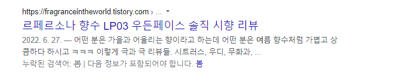

# 사용자 취향 기반 향수 추천 서비스

하면서 어려웠던 점
---------------
1. 향수 특징을 나눌 때 주관적인 부분이 많아서 데이터 수집이 어려웠다.
예를 들어 특정 향수는 누군가가 쓰기에 남녀공용향수이고 누군가에겐 여자향수 일 수도 있기 때문, 계절도 마찬가지
 ㅜㅜ

2. 향수 데이터에 관한 오픈 api가 없어서 데이터 수집이 어려웠다.

------------------
### 기능
1. 메인기능 - 설문통해 향수 추천 (향 무드 옷스타일 계절 성별)  5가지 질문
- 향수 쓸때 팁? (이 향수 여름에 3번뿌리고 나가면 칼빵맞아요) 
옷 -> 데일리 (데일리하게입는걸 좋아하는사람) , 슈트 (정장같은거 격식차린 분위기) 
> 무거운향수
> 가벼운향수
4. 향수별 가을 겨울 -> 여름에 뿌리지말라 < 메세지 정해야겠다.
3. 성격은 따로 (추가기능)

   //플로럴 무드1 댄디 겨울 남자 -> json으로 받았어 -> answerOfSurvey-> 쪼개 first second third fourth fifth 로 쪼개 ->
   // 쪼개서 찾자
   //
- 질문 받는 형식 Get, Put 정해야함, 메서드도 정해야함.

-------
### 2번째 기능
브랜드 찾아서 -> 이 향수와 비슷한 향 추천
(창조교수님) 내 여친이 특정 향수를 쓰는데 -> 그 향수와 어울리는 향 

여기까지 2월 목표
------
3월부터는
### 성격
> 성격에따른 향수 추천 (재미용)
> 전체적인 기획 (무대, 시설, 기자재, 향 -> 냄새 맡게해주는 것도?, 사용자가 가져갈만한 굿즈같은거)
>  카카오로 공유하기? -> 
> 단위테스트.
----------------
## 계획 
-------------
1. 2월까지 메인기능은 다 개발하는걸로 하자
2. 21일까지 남은 두개 질문 다 채우기

그때그때 작성하는 회고!
---------
처음 survey에 대한 answer entity를 세울 때, 우리 졸작은 설문 질문의 갯수를 어차피 
늘릴 리 없다고 판단하여, 그리고 더 쉬우니까..? 각 질문별로 필드를 만들었다(first answer, second answer~~)
하지만, 이렇게 코드를 짜면 
1. 엔티티가 무거워진다. 그럼 결국 프로그램의 성능 저하에도 영향을 미친다.
2. 확장성이 사라진다. 질문이 늘어나면 확장하기가 어려워진다.
3. 유지 보수가 어려워진다. 앞과 비슷하게 질문이 늘어나면 엔티티,dto,repository,controller,service 모든 코드를 수정해야한다.
라는 큰 단점들이 보였고, '추후에도 프로젝트를 할 때 이렇게 쉬운 길로만 코드를 짤 것인가?' 라는 괴리감에 빠졌다.
따라서 확장이 용이하게 답변은 하나로 받고, 내부에서 쪼개는 로직을 짰다.
