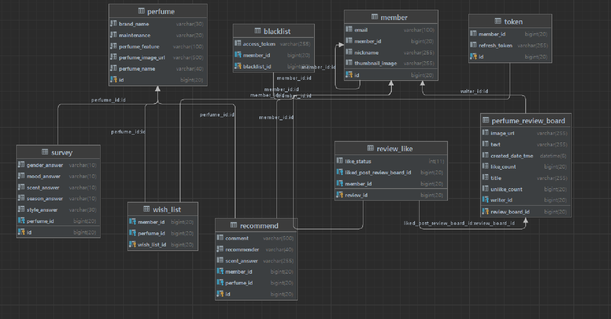
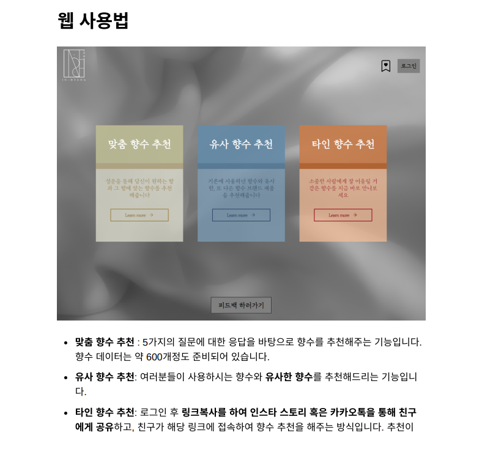
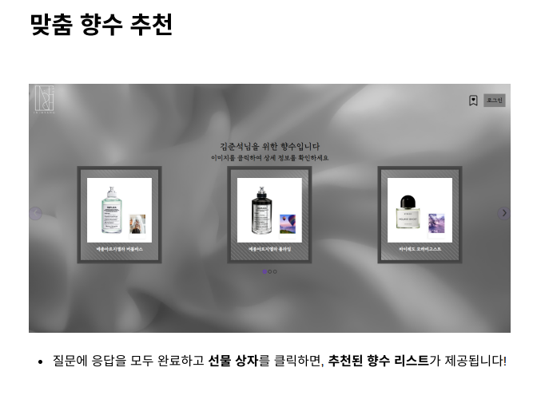
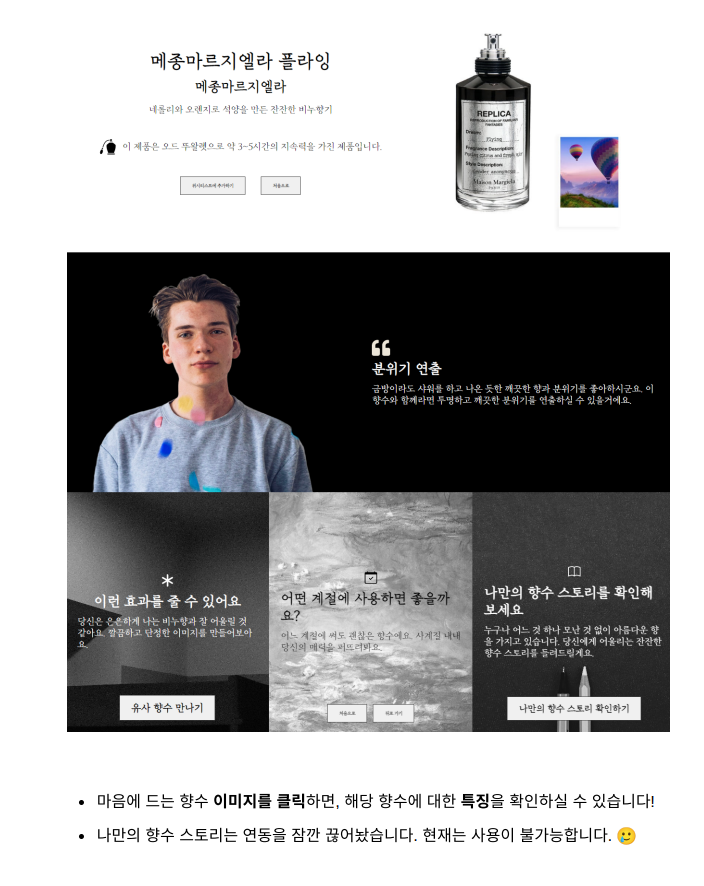
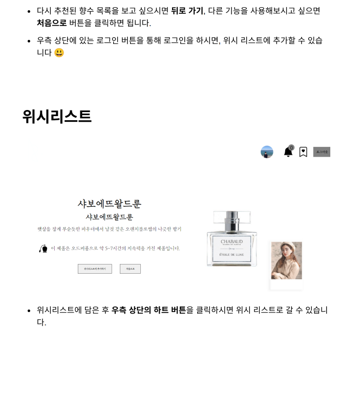
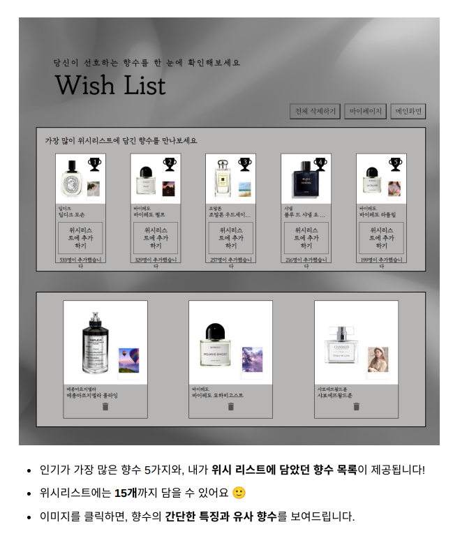
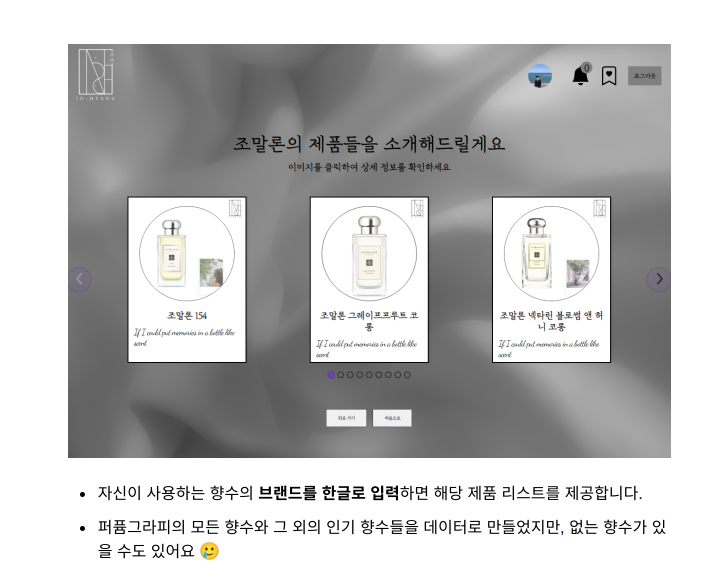
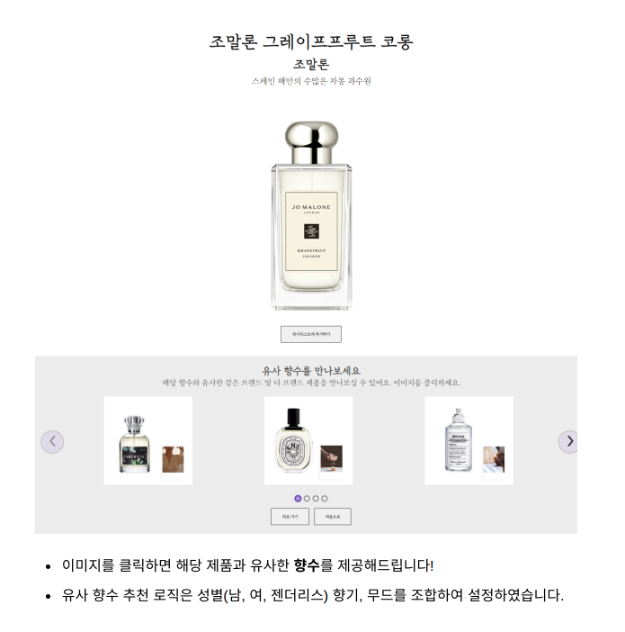
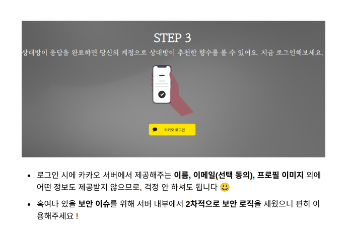

# 사용자 취향 기반 향수 추천 서비스

 

* <b> 프로젝트 기간: 2023.01.16 ~  </b>

 

### ☄️ 1. 향

 

### 🧑🏻‍💻참여 인원 👩🏻‍💻
| 이름  | 파트  | 역할                                    |
|-----|-----|---------------------------------------|
| 김준석 | BE  | 카카오 로그인, 첫번째 기능, 두번째 기능, 세번째 기능 구현    |
| 박찬욱 | FE  | 메인 Ui, 첫번째 기능, 두번째 기능, 세번째 기능, 로그인 구현 |
| 박건희 | 기획  | 작품의 아이디어, 컨셉 기획                       |

 ---

### TECH STACK
‍💻 Back-End
- ☑️Java 11
- ☑️SpringBoot
- ☑️AWS EC2 (UBUNTU)
- ☑️AWS RDS (MYSQL)
- ☑️Nginx
- ☑️Spring Security
- ☑️Spring JPA
- ☑️카카오 Oauth
- ☑️Chat GPT Api
- ☑️Swagger

‍💻Front-end
- ☑️React

## 프로젝트 진행 상황 

-------------------
| 기능                         | 개발 기간                 |   구현     | 담당자
|----------------------------|-----------------------| ---- | ---- | 
| 데이터 크롤링                    | 2023/01/13~2023/01/14 |  ✅ | 준석
| 향수 추천 기능                   | 2023/01/26~2023/02/08 |  ✅ | 준석
| 유사한 향수 추천                  | 2023/02/09            |  ✅ | 준석
| 방명록 기능 구현                  | 2023/02/10~2023/02/16 |  ✅ | 준석
| 카카오 Oauth, 로그인             | 2023/02/17~2023/02/25 |  ✅ | 준석
| 타인이 보는 나의 향수               | 2023/02/26~2023/02/27 |  ✅ | 준석
| 로그인 기능 리팩토링                | 2023/02/28~2023/03/02 |  ✅ | 준석
| 테스트코드 작성                   | 2023/03/03~2023/03/08 |  ✅ | 준석
| 로그인 기능 리팩토링                | 2023/03/08~2023/03/09 |  ✅ | 준석
| 버그 수정 및 리팩토링               | 2023/03/09~           |  ✅ | 준석
| 타인이 추천해준 향수 결과 분석          | 2023/03/12~2023/03/15 |  ✅ | 준석
| 로그아웃 api 구현                | 2023/03/16            |  ✅ | 준석
| 유사한 향수 추천 재개발              | 2023/03/17~2023/03/19 |  ✅ | 준석
| 버그 수정 및 리팩토링               | 2023/03/19~2023/03/29 |  ✅ | 준석
| HTTPS 배포                   | 2023/03/29            |  ✅ | 준석
| 버그 수정 및 리팩토링               | 2023/04/05~2023/04/13 |  ✅ | 준석
| Chat Gpt(향수 스토리 생성) Api 개발 | 2023/04/14~2023/04/26 |  ✅ | 준석
| Swagger 적용                 | 2023/05/03~2023/05/02 |  ✅ | 준석
| 향수 위시리스트 구현                | 2023/04/27~2023/05/05 |  ✅ | 준석
| 향수 리뷰 게시판 구현               | 2023/07/06~2023/07/11 |  ✅ | 준석
| 리뷰 좋아요 기능 구현               | 2023/07/12~2023/08/16 |  ✅ | 준석
| 리뷰 신고 기능 구현                | 2023/08/17~2023/08/18 |  ✅ | 준석
| SMTP 이메일 Sender 구현         | 2023/08/20~2023/08/20 |  ✅ | 준석

## ERD

## Version 1.0.1
- ☑️ 계절 '상관없음' 항목 추가
- ☑️ 옷 스타일 -> '미니멀','스트릿' 항목 추가
- ☑️ Chat GPT API를 이용하여 향수를 추천받을 때 해당 향수에 관한 스토리를 제공

## Version 1.0.2
- ☑ 향수 위시리스트 
- ☑ 향수 리뷰 게시판
- ☑ 리뷰 좋아요, 신고 기능

# 인:향 메뉴얼

----

----

