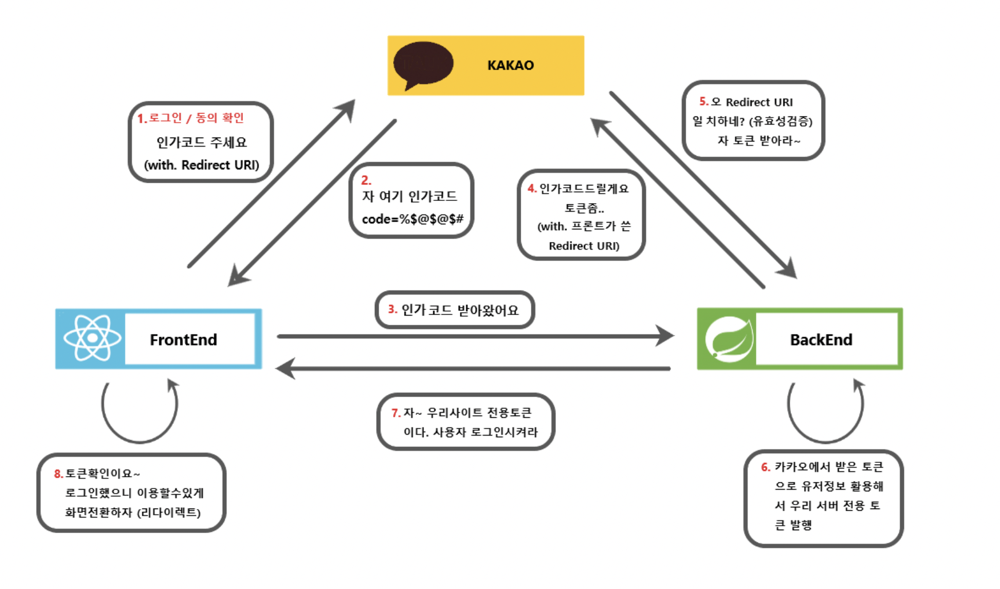

# 사용자 취향 기반 향수 추천 서비스

하면서 어려웠던 점
---------------
1. 향수 특징을 나눌 때 주관적인 부분이 많아서 데이터 수집이 어려웠다.
   예를 들어 특정 향수는 누군가가 쓰기에 남녀공용향수이고 누군가에겐 여자향수 일 수도 있기 때문, 계절도 마찬가지
    ㅜㅜ

2. 향수 데이터에 관한 오픈 api가 없어서 데이터 수집이 어려웠다.

------------------
### 기능
1. 메인기능 - 설문통해 향수 추천 (향 무드 옷스타일 계절 성별)  5가지 질문
- 향수 쓸때 팁? (이 향수 여름에 3번뿌리고 나가면 칼빵맞아요)
  옷 -> 데일리 (데일리하게입는걸 좋아하는사람) , 슈트 (정장같은거 격식차린 분위기)
> 무거운향수
> 가벼운향수
4. 향수별 가을 겨울 -> 여름에 뿌리지말라 < 메세지 정해야겠다.
3. 성격은 따로 (추가기능)

   //플로럴 무드1 댄디 겨울 남자 -> json으로 받았어 -> answerOfSurvey-> 쪼개 first second third fourth fifth 로 쪼개 ->
   // 쪼개서 찾자
   //
- 질문 받는 형식 Get, Put 정해야함, 메서드도 정해야함.

-------
### 기능 정리
1. 향수 db 조회 (이름, 브랜드로)
2. 설문을 통해 향수추천받기 (5가지 설문)(만약 최적의 결과가 DB에 없을 시엔 범위를 늘려서 찾음)
3. 내가 쓰는 향수와 비슷한 결의 향수 추천
4. 방명록 기능 어떨까? (방명록 쓰고 ) -> 방명록 어떤 방식으로 view해줄지 고민해보기
5. 향수 특징 메세징 처리 (ex 향수 셀렉하면 : 이 향수는 ~~계절에 쓰기 좋아요! 이런 것) 
6. 성격과 결합시키는 ? -> 이건 어케하지..?
7. 해야할 거 - > 메인기능 추천 맥시멈 5개까지만 추천되게?
-----
### 2월 3주차 해야할 것
1. 향수 데이터가 부족한 것 같다. (비싼향수만 많음.. 저렴한 향수 데이터도 좀 채워야할듯?) 

### 고려해볼만한 기능
1. 다른사람이 나한테 잘 어울릴 것 같은 향수를 찾아주는 기능
2. 링크를 생성해준다 -> 해당 링크접속해서 박찬욱은 메인기능과 똑같은 설문을 통해 김준석의 이미지와 잘 어울릴 것 같은 향수를 찾는다.
3. 그 데이터는 로그인을 완료한 사용자의 추천받은 목록에 반영된다.
4. 
-> 로그인이 필요함. 로그인을 하고 

## 계획
-------------
1. 2월까지 메인기능은 다 개발하는걸로 하자
2. 21일까지 남은 두개 질문 다 채우기

그때그때 작성하는 회고!
---------
처음 survey에 대한 answer entity를 세울 때, 우리 졸작은 설문 질문의 갯수를 어차피
늘릴 리 없다고 판단하여, 그리고 더 쉬우니까..? 각 질문별로 필드를 만들었다(first answer, second answer~~)
하지만, 이렇게 코드를 짜면
1. 엔티티가 무거워진다. 그럼 결국 프로그램의 성능 저하에도 영향을 미친다.
2. 확장성이 사라진다. 질문이 늘어나면 확장하기가 어려워진다.
3. 유지 보수가 어려워진다. 앞과 비슷하게 질문이 늘어나면 엔티티,dto,repository,controller,service 모든 코드를 수정해야한다.
   라는 큰 단점들이 보였고, '추후에도 프로젝트를 할 때 이렇게 쉬운 길로만 코드를 짤 것인가?' 라는 괴리감에 빠졌다.
   따라서 확장이 용이하게 답변은 하나로 받고, 내부에서 쪼개는 로직을 짰다.

근데, 개발을 하면서 Jpa Specification 같은 개념들을 잘 모르고 쓰니까 되려 어려워졌다.
그래서 다시 질문을 나누었고, 기본적으로 제공하는 Containing, NotContaining 류의 쿼리들만을 사용해서 개발했다.

- 최대한 쉽게 짜려고 노력했으나, 여러 질문들을 조합해서 최적의 답을 찾아내는 과정을 만들다보니.. 그것들을 또 DB에서 찾아서 해결하려고 하니
  조금 힘들었다. 그래서 코드가 조금 지저분해진 것 같다.
- 또, 계속 리팩터링 하면서 '메서드를 무조건 잘게,잘게 쪼개 분리하는것이 최고다' 라고 생각했던 생각이 조금은 달라졌다.
  계속 쪼개다보니 결국 세네줄짜리 메서드가 됐는데, 결국 한 곳에서만 쓰이게되었고, 과연 이게 효율성이 좋을까에 대한 생각을 했다.
  하나의 메서드를 여러 곳에서 재사용 할 수 있으면 굳이 더 쪼갤 필요가 없을 것이라 생각하고, 다시 리팩터링 하였다.
  그리고 그 재사용성이 높은 메서드는 Util 객체를 새로 생성해 담았다.

#카카오 로그인 Oauth
----------------------

